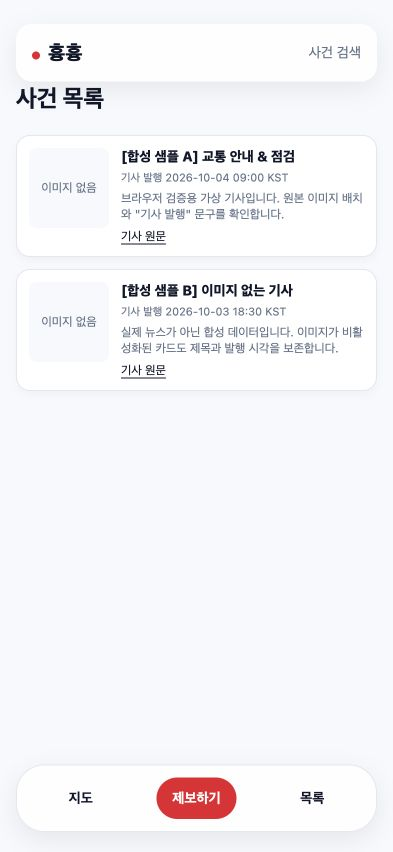
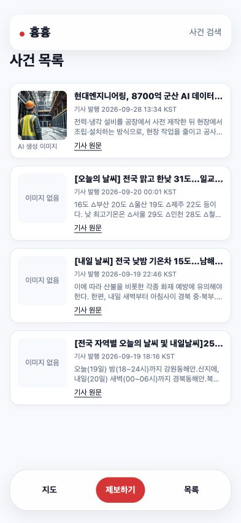

# 기사 이미지 실패 처리 검증

승인 기준선: `bac5e625fc7fc8e1b73e3f73dcdac03ebfd70a6e`.
검증한 기능 소스: `1b8805391c12bc342e8e57419cd9fc8e141cf705`.
독립 완료 리뷰 HEAD: `7d020f288ed353462d720f2f6be597d23736487c`.
production build ID: `OWbzFd4lTer-d0zTE9Ulj`.

## 동작과 범위

기사의 검증된 이미지 URL만 작은 `ArticleImage` client 컴포넌트에 전달한다. 이미지의 error 이벤트가 오면 img와 AI 생성 이미지 캡션을 제거하고 기존 80×80 placeholder를 표시한다. 바깥 article의 key는 article_id를 유지하고, 이미지의 key만 URL로 지정해 새 URL에서 실패 상태를 초기화한다. 기사 조회·텍스트·날짜·원문 URL 검증·CSS·공용 UI는 변경하지 않았다.

## 승인과 전체 검사

[승인 기록](approval.md)의 명세·공통 헤더·두 테스트·jsdom27.4.0 package/lock 지원안을 정확한 해시로 적용했다. 기존 21개 테스트, fixture, Vitest 설정과 acceptance 명령은 그대로다. [공식 체크포인트 원본](evidence/implementation/checkpoints-1b88053.json)에는 다음 실행 증거가 있다.

| 항목 | RED | 전체 GREEN | 체크포인트 |
|---|---|---|---|
| articleImageErrorPreservesCards | 오류 이벤트 뒤 img가 남음 | 22개 | afab0ddf3616826398eb287f4460b5ae093b7484 |
| articleImageRecoversForNewSource | 새 URL에도 기존 실패 상태가 남음 | 23개 | 1b8805391c12bc342e8e57419cd9fc8e141cf705 |

각 체크포인트는 pinned Sobaya83af28d가 승인 헤더·본문·기존 테스트 보존, 실제 전체 suite, format/lint와 커밋을 검증한 결과다. 워커의 완료 보고만으로 진척을 기록하지 않았다. [첫 실행 로그](evidence/implementation/step1.txt), [두 번째 실행 로그](evidence/implementation/step2.txt).

- `pnpm run typecheck`: exit0. [로그](evidence/implementation/typecheck-1b88053.txt).
- `pnpm run build`: exit0. `/incidents`는 dynamic route. [로그](evidence/implementation/build-1b88053.txt).
- 기존21개 테스트·Vitest 설정이 기준선과 같고 spec/package/lock이 승인 proposed 파일과 일치함을 다시 확인했다. 승인 계획에는 런타임이 검증한 두 체크박스만 바뀌었다.
- 최종 `review.sh`가 clean HEAD7d020f2에서 전체 gate를 통과한 뒤 읽기 전용 독립 리뷰를 수행했고 **PASS**했다. 23개 통과·실패0·skip0이며 추가 actionable finding은 없었다. [현재 host gate 원본](evidence/implementation/host-final-gate-7d020f2.json), [최종 실행 로그](evidence/implementation/final-review-7d020f2.txt), [독립 리뷰 결과](evidence/implementation/independent-review-7d020f2.json), [clean HEAD와 완료 상태](evidence/implementation/completion-7d020f2.json). 이후 커밋은 완료 증거·협업 기록·plan 보관만 수행하며 기능 소스와 테스트는 동일하다. 내부 Vitest 임시 JSON은 정상 정리되므로 경로 부재를 미실행으로 해석하지 않는다.

## 소스 독립 검토와 환경 진단

별도 컨텍스트의 소스 검토에서 client 경계·URL key 전환·접근성·카드 보존의 추가 결함을 발견하지 못했다. 이는 최종 하네스 리뷰와 구분한다. [검토 범위](evidence/implementation/source-review.json).

초기 테스트 환경에 실제 SOBAYA_ROOT가 임시 fixture로 상속돼 기존 hooks/sobaya 검사가 실패했다. 앱·테스트를 고치지 않고 task-local 환경에서만 해당 export를 제거했다. 동일 hooks84개와 sobaya32개가 통과한 후 보존된 승인 상태에서 resume했다. doctor의 custom hook 불일치도 실제 위임 체인과 비교해 진단했으며 doctor 전체 PASS로 보고하지 않는다. [진단·복구 기록](evidence/implementation/preflight.md)과 같은 폴더의 원본 로그를 보존했다.

## 실제 브라우저

새 기능 소스와 production build에 연결한 별도 로컬 fixture로 HTTP404, HTTP200 손상 이미지, 정상 이미지 복원을 확인한다. 같은 React mount에서 URL만 바뀌는 회복은 승인 DOM 테스트의 증거이며 브라우저 새로고침과 구분한다. 실제 화면·DOM geometry·응답 로그를 확인했으며 아래 결과는 위 소스와 build에 바인딩돼 있다.

- HTTP404: 뉴스200 뒤 이미지 요청 두 건 모두404/completed=true. 최종 img·AI캡션 없음, placeholder80×80, 제목·요약·KST/ISO·원문href·두 카드 순서 유지.
- HTTP200 손상 JPEG: 브라우저 해독 실패 뒤 동일한 fallback. 초기 스트리밍 중 geometry0인 중간 DOM은 최종 결과로 계산하지 않았다.
- 정상 모드로 새로고침하면 실제 이미지 naturalWidth1024·80×80·AI캡션이 복원됐다. 같은 mount의 URL 변경 증거로 대신 주장하지 않는다.
- 실제 API: 기사4개, 정상 이미지1개와 placeholder3개. 1440×1000 및393×852에서 가로 넘침 없음, 모바일 카드x16/width361. 정상 이미지80×80.
- 모든 최종 관찰의 조회된warn/error로그는 빈 배열이다. 정확히 hydration 전 오류가 발생했다거나 모든 네트워크 오류가 콘솔에 포착됐다고 단정하지 않는다. 실제 SSR→hydration 뒤 fallback 전환과 최종 화면을 확인했다.

[DOM·geometry·로그 원본](evidence/browser/browser-observations.json), [요청 완료 로그](evidence/browser/fixture-requests.ndjson), [합성 fixture 코드](evidence/browser/fixture-source.mjs.txt), [소스 해시](evidence/browser/source-sha256.txt).

사용자 미리보기는 http://127.0.0.1:3005/incidents 에 실제 API를 연결한 production server다. 임시 오류 fixture는 별도로 종료한다.

## 회고

Brain: 기존 원칙을 적용하고 실행 환경 누출의 구체 진단은 이 기능의 증거에 보존했다. 루트 vault 변경 없음.
Skills: 변경 없음. React best practices를 적용해 상태·client 전달값·접근성을 점검했다.
Structural: 승인 기준선과 보호된 입력·테스트·훅·정책을 보존했다.
Todos: 더 보기·공용 UI·상세·제보·배포는 별도 제안에 남기며 이번 구현에 포함하지 않았다.

## 최종 인수인계

- spec.md·failed-test.md는 gate·review 뒤 `collab/journal/plans/2026-10-05-amazon-article-image-fallback/`에 보관한다. 이후 이 브랜치에서 Sobaya 명령을 다시 실행하지 않는다.
- [브라우저 독립 보고서](evidence/browser/browser-review.md), [본문·원문 비교 결과](evidence/browser/content-comparison.json). 이 메모는 리뷰 이후 보존했으며 underlying 관찰·소스·스크린샷은 리뷰된 버전과 같다.
- 로컬 실제 API 서버는3005/PID44977, 오류 재현3004/39072는 종료했다. 기존39071은 보존했다.
