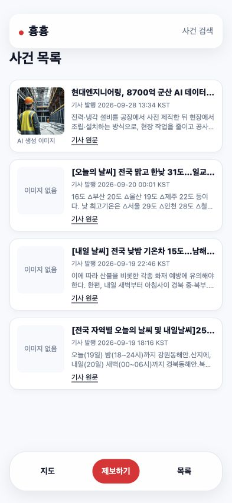

# 기사 API 연결 검증 증거

검증한 기능 소스: `fec482341f83561706b1cf176bb6d1d66aa81463`.
승인 기준선: `7f05d14cf62812a69bcd8318983f5f07e49847e6`.
독립 완료 리뷰 HEAD: `6c17ea0a79807b3d5bb1b15eb4707631faca5328`. canonical status는 complete, active=null, pending=[], dirty=false이며 review.head=HEAD였다. [완료 상태 원본 필드와 승인 항목](evidence/completion-6c17ea0.json), [최종 gate·리뷰 실행 로그](evidence/final-review-6c17ea0.txt).

그 뒤 마지막 커밋은 협업 문서·증거·claim 갱신과 승인 plan 보관만 수행한다. 기능 소스와 승인 테스트는 변경하지 않으며, 보관 뒤 이 브랜치에서 Sobaya 명령을 다시 실행하지 않는다.

## 공식 검사

- pinned Sobaya `83af28d`의 `gate.sh`를 clean 기능 HEAD에서 실행했고 **exit 0 / PASS**를 확인했다. [실제 host gate 로그](evidence/gate-fec4823.txt).
- gate는 승인된 8개 라우트 테스트와 기존 13개 테스트를 포함하는 전체 선언 명령 `./node_modules/.bin/vitest run`, format, lint, 보호된 입력과 승인 항목 실행 여부를 검사한다. 테스트·명세·지원 설정을 약화하지 않았다.
- `gate.sh`는 내부 Vitest JSON을 파싱한 결과의 출력과 PASS를 보여준다. 로그에 있는 임시 JSON 경로는 정상 정리됐으며, 임시 파일 부재를 검사 미실행으로 해석하지 않는다. `tdd-set/lib/contract.sh`의 `contract_gate`·`contract_suite`가 성공·누락·skip 검사를 소유한다.
- `pnpm run typecheck` exit 0. `NEWS_API_BASE_URL` 없이 `pnpm run build` exit 0, `/incidents`는 동적 route로 출력됐다. [운영용 빌드 로그](evidence/build-fec4823.txt).
- 실행 시에만 실제 API 주소를 설정한 production server에서 기사 4개를 확인했다. 빌드 시 환경변수 부재 때문에 오류 화면이 고정되던 문제는 재현 후 수정했다.

## 실제 브라우저

[상태별 관찰과 revision별 범위](browser-verification.md)에 실제 화면·요청 증거를 기록했다.

- `fec4823`: 실제 API 4카드, 원본 RFC와 ISO/KST 대응, ready 이미지 실제 로드(naturalWidth 1024, 표시 80×80), 393px 가로 넘침 없음, 카드 x=16/width=361.
- `7ed5e41`: 합성 정상·긴 제목 및 HTTP 503 뒤 실제 재시도 클릭으로 회복.
- `55b3f03`: 320px/393px/1457px, 중복 3행→2카드, 빈 결과, 2초 로딩 직접 관찰, 5000ms 요청 취소, 키보드 원문 이동, 이미지 404 확인. 이후 차이는 날짜 파싱 보완이며 이 범위를 최종 revision에서 전부 반복했다고 주장하지 않는다.
- 전체 상태 검증 후 새 source에서는 공식 8개 route 테스트·전체 gate와 실제 API 날짜를 다시 확인했다.

## 독립 리뷰 발견 사항과 보완

- `65d2869`: 빌드 시 오류 화면 고정, 일반 본문의 비교 기호 삭제·따옴표 안의 > 오처리, 잘못된 달력 날짜 보정. 동적 route와 태그 인식·달력 검증으로 보완.
- `55b3f03`, `7ed5e41`: 모호한 날짜 형식 및 잘못된 시간대·접미 문자를 native Date가 재해석. 문자열 전체를 RFC/ISO 형식으로 확인하고 달력·시각·시간대를 검증한 뒤 UTC를 직접 계산하도록 보완.
- `fec4823`의 앞선 독립 리뷰는 **구체적인 코드 결함 없음**, 읽기 전용 child에서 Vitest 임시 파일 생성 EPERM 및 host/browser 증거를 찾지 못해 handoff였다. [당시 결과](evidence/historical-review-fec4823.json)는 현재 완료 증거가 아니다.
- pinned `r_review`는 host의 `contract_gate` 성공 후에만 reviewer를 호출한다. 이번에는 실제 host gate 로그와 브라우저 증거를 커밋하여 새 독립 리뷰에서 직접 확인하도록 했다. reviewer가 자기 sandbox에서 실행하지 못한 검사를 실행했다고 주장하면 안 된다.
- 추가 날짜 진단은 정상 13건·잘못된 입력 22건과 정확한 ISO 24:00:00 호환성을 실제 컴포넌트 SSR로 확인했다. [결과](evidence/date-diagnostics-fec4823.json), [진단 입력](evidence/date-cases.mjs.txt), [진단 코드](evidence/date-probe.mjs.txt). 이는 공식 승인 테스트를 대체하거나 새 승인 기준선을 뜻하지 않는 수동 진단이다.

## 남은 범위와 통합 조건

- ready 이미지 파일이 404면 카드·원문 링크는 남지만 깨진 이미지와 AI 캡션이 표시된다. 자동 placeholder 전환은 별도 개선 사항이다.
- Figma의 카드 배치·간격·80px 이미지·글자 크기는 반영했다. 발행·원문·AI 캡션으로 카드 높이는 122–123px이며 원본 120px과 완전 일치하지 않는다. 공용 폰트·기존 배지·헤더·필터는 이번 범위 밖이다.
- 실제 API 첫 카드의 원문 링크를 클릭해 한국금융경제신문의 해당 기사 제목·응답 화면에 도착하고 앱으로 돌아왔다. [관찰 기록](evidence/browser-original-link-fec4823.md). 나머지 3개 외부 원문은 방문하지 않았고, 키보드 Tab/Enter는 로컬 합성 원문으로 검증했다.
- PR #2는 외부 리뷰 대기다. 기능 PR 대상은 dev이며 선행 PR 의존성을 명시해야 한다. 다른 claim을 지우거나 협업 검사를 완화하지 않는다.
- 로컬 실행은 `.env.example`의 `NEWS_API_BASE_URL`을 `.env.local` 또는 실행 환경에 설정한다. 이 작업에서 API 수집 POST·운영 설정 변경·PR 병합은 하지 않았다.

## 회고

Brain: 기존 검증 증거 보존·read-only worker 제약 원칙을 적용했으며 루트 brain 변경 없음.
Skills: 변경 없음.
Structural: 테스트·훅·정책 변경 없이 host 증거를 앱 협업 산출물에 보존.
Todos: 이미지 404 대체 표시와 공유 UI 차이를 위의 후속 범위로 기록.
